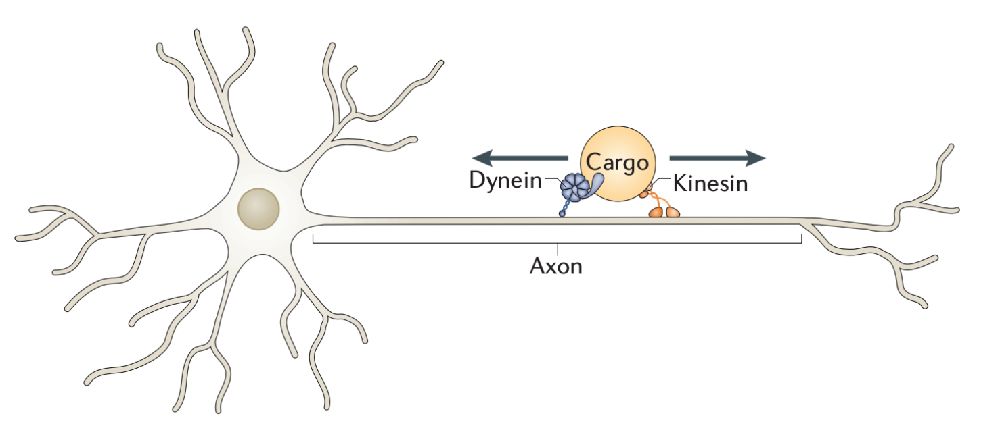
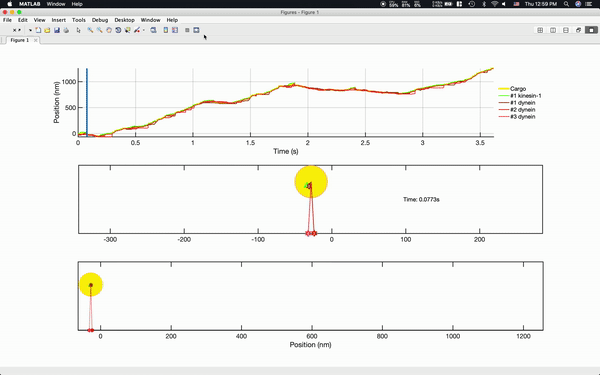

### Biological Description

In cells, small molecules move by passive diffusion (brownian motion, ink in a dye). However, large molecules require active force for movement. "Cars" inside cells can transport their "cargo" to a desired destination. These "cars" or proteins are called kinesin and dyenin.

### Why this study is important

These proteins are responsible for transporting ingredients necessary to create "messages" for neurons to communicate (neurotransmitters). Being able to predict the movement of these proteins may be helpful to develop novel drugs/methods for neural-related diseases (Alzheimers, ALS, etc). People who do not have proper function of these proteins are linked with the above disease.

Here we have simulation results for two differnt proteins, kinesin-1 and dynein.

Key descoveries are

1. Detachment kinetics play a higher role in how a cargo is being trasported, rather than how strong (high stall force) or how fast (high forward stepping kinetics)
2. Yildiz's data of 1 kinesin-1 vs 1 DDB were successfully recapitulated and hence we propose a theoretical coarse-grain model of how the cargo is transported

## How to run

Run PaperCodes > OpticalTrap.m for single molecule run-velocity, run-length for kinesin-1, kinesin-2 and cytoplasmic dynein
Run PaperCodes > TugOfWar.m for multi-motor cargo transport in kinesin-1, kinesin-2 and cytoplasmic dynein
Run Animation > test_cargo.m for animation

For visuals/presentation please check out this [link](https://docs.google.com/presentation/d/1deDom1l2jmYkOxjQe5uOUbkkLrrGXNAc-oXJMULMTSo/edit?usp=sharing)

For more info please contact kao110@g.harvard.edu
